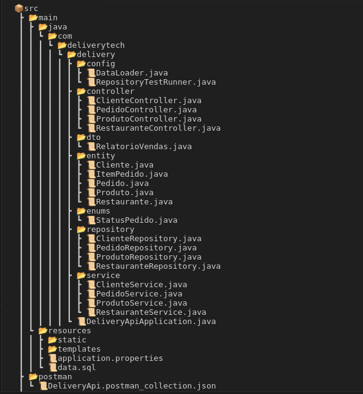

# 🍔 DeliveryTech API

Sistema de delivery desenvolvido com **Spring Boot** e **Java 21 LTS** para gerenciar clientes, restaurantes, produtos e pedidos.

---

## 🚀 Tecnologias Utilizadas
- Java 21 LTS  
- Spring Boot 3.5.6  
- Spring Web  
- Spring Data JPA  
- H2 Database (em memória)  
- Maven  

---

## ⚙️ Recursos Modernos (Java 21)
- Records  
- Text Blocks  
- Pattern Matching  
- Virtual Threads  

---

## 🏃‍♂️ Como Executar o Projeto

### 🔹 Pré-requisitos
- JDK 21 instalado  
- Maven configurado (ou usar o wrapper `./mvnw`)

### 🔹 Passos para rodar
1. Clonar o repositório:
   git clone https://github.com/DimasRabelo/delivery-api.git
   cd delivery-api
2. Executar a aplicação:
   ./mvnw spring-boot:run
3. Acessar no navegador:  
   http://localhost:8080

---

## 🧩 Estrutura das Pastas

## 🧪 Testes com Postman

Na pasta `postman/` há uma collection chamada **DeliveryAPI.postman_collection.json**, contendo todos os endpoints configurados para teste.

**Como importar:**
1. Abra o Postman  
2. Clique em **Import**  
3. Selecione o arquivo `DeliveryAPI.postman_collection.json`  
4. Execute as requisições para testar os endpoints  

**Essa collection cobre:**
- CRUD completo de Clientes, Restaurantes e Produtos  
- Criação e consulta de Pedidos  
- Testes de filtros, status e valores calculados  

---

## 📋 Principais Endpoints

| Método | Endpoint | Descrição |
|:-------|:----------|:-----------|
| **POST** | `/clientes` | Cadastrar novo cliente |
| **GET** | `/clientes` | Listar todos os clientes |
| **GET** | `/clientes/{id}` | Consultar cliente por ID |
| **PUT** | `/clientes/{id}` | Atualizar dados de cliente |
| **DELETE** | `/clientes/{id}` | Inativar cliente |
| **GET** | `/restaurantes` | Listar restaurantes |
| **GET** | `/restaurantes/categoria/{categoria}` | Buscar por categoria |
| **POST** | `/produtos` | Cadastrar produto |
| **GET** | `/produtos/restaurante/{id}` | Listar produtos de um restaurante |
| **POST** | `/pedidos?clienteId=1&restauranteId=1` | Criar pedido |
| **GET** | `/pedidos/cliente/{id}` | Consultar pedidos por cliente |

---

## 🗄️ Banco de Dados H2

A aplicação utiliza **H2 em memória**.  
Acesse o console em:  
http://localhost:8080/h2-console

**Configurações:**
- JDBC URL: `jdbc:h2:mem:deliverydb`  
- User Name: `sa`  
- Password: *(em branco)*

---

## 📦 Dados Iniciais (data.sql)

O arquivo `data.sql` popula o banco com:  
- Clientes (João, Maria, Pedro, Dimas)  
- Restaurantes (Pizzaria Bella, Burger House, Sushi Master)  
- Produtos e pedidos de exemplo  

---

🏗️ Atividades Desenvolvidas
⚙️ Implementação dos Repositories

ClienteRepository: findByEmail, findByAtivoTrue, findByNomeContainingIgnoreCase, existsByEmail

RestauranteRepository: findByCategoria, findByAtivoTrue, findByTaxaEntregaLessThanEqual, findTop5ByOrderByNomeAsc

ProdutoRepository: findByRestauranteId, findByDisponivelTrue, findByCategoria, findByPrecoLessThanEqual, consultas customizadas com @Query

PedidoRepository: findByClienteId, findByStatus, findTop10ByOrderByDataPedidoDesc, findByDataPedidoBetween

🧪 Testes de Persistência

Classe DataLoader implementando CommandLineRunner

Inserção de dados de teste: 3 clientes, 2 restaurantes, 5 produtos, 2 pedidos

Validação de consultas derivadas e customizadas

Exibição de resultados no console H2

Confirmação de relacionamentos entre entidades

🔍 Consultas Customizadas e Relatórios

Total de vendas por restaurante

Pedidos com valor acima de X

Relatórios por período e status

Produtos mais vendidos (query nativa opcional)

🛠️ Configuração e Validação

Banco H2 configurado em memória (create-drop)

Console H2 habilitado

Logs SQL ativos e queries formatadas

Estrutura de tabelas e relacionamentos validados

## 👨‍💻 Desenvolvedor

**Dimas Aparecido Rabelo**  
🎓 Curso: Arquitetura de Sistemas  
💻 Tecnologias: Java 21 | Spring Boot | H2 | Maven  
📍 Projeto desenvolvido para o módulo de **Persistência de Dados**
